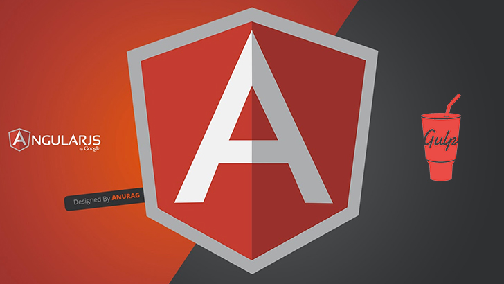

# Angular + Gulp: Fast built

## Installation

Before running any Gulp tasks:

1. Check out this repository
2. Ensure you have **node** installed
4. Almost, ensure you have **ruby**, **compass** and **singularitygs** installed
3. Run `npm install` and `bower install` in the root directory

## Project Structure

The project ships with a directory structure like:

    /angular-gulp
    |---- package.json
    |---- bower.json
    |---- gulpfile.js
    |---- /app
    |     |---- index.jade
    |     |---- app.js
    |     |---- /scss
    |     |     |---- app.scss
    |           ...
    |     |---- /components
    |           |
    |           ...
    |---- (/dist.dev)
    |---- (/dist.prod)
    
## Gulp Tasks

All of the following are available from the command line.

### Essential ones

These tasks I use as part of my regular developments and deploy scripts:

- __`gulp watch-dev`__ Clean, build, and watch live changes to the dev environment. Built sources are served directly by the dev server from /dist.dev.
- __`gulp watch-prod`__ Clean, build, and watch live changes to the prod environment. Built sources are served directly by the dev server from /dist.prod.
- __`gulp`__ Default task builds for dev. Built sources are put into /dist.dev, and can be served directly.
